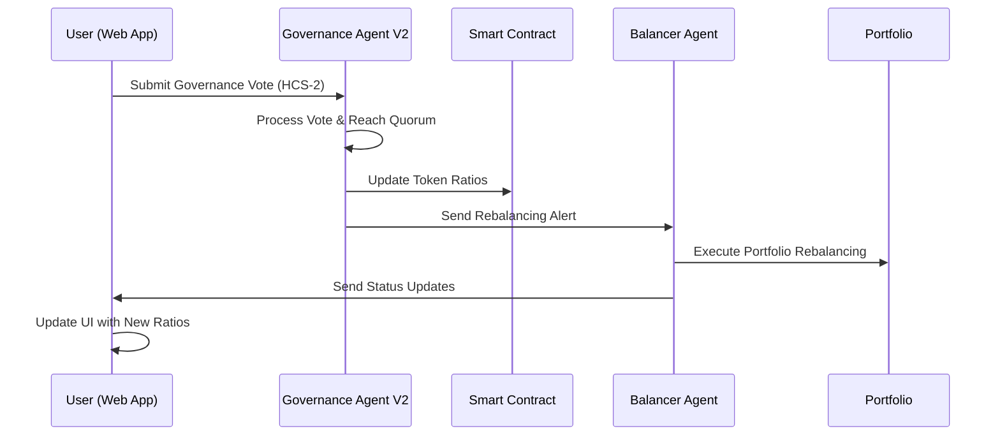

```
╔═══════════════════════════════════════════════════════════════╗
║                  🏛️ LYNX TOKENIZED INDEX                      ║
║           Decentralized Portfolio Governance Dashboard        ║
╚═══════════════════════════════════════════════════════════════╝
```


## 🎯 Overview

**Lynx** is a decentralized DAO governed tokenized index on Hedera. This dashboard is a prototype of the minting and governance interface for the Lynx ecosystem, enabling users to mint LYNX tokens and participate in decentralized governance decisions that control the underlying (testnet) portfolio composition.

The system leverages **[Lynx Governance Agent V2](https://github.com/0xPrimordia/lynx-governance-agentv2)** and **[Lynx Balancer Agent](https://github.com/0xPrimordia/lynx-balancer-agent)** powered by Hedera Agent Kit to provide fully autonomous portfolio management through HCS (Hedera Consensus Service) messaging.

### ✨ Key Features

- 🪙 **Token Minting** - Convert between portfolio tokens and LYNX index tokens
- 🗳️ **Governance Voting** - Submit and track portfolio ratio changes through HCS-2
- 📊 **Real-time Portfolio Monitoring** - Live updates of token balances and ratios
- 🔗 **Agent Integration** - HCS communication with autonomous governance and balancer agents
- 💼 **Wallet Integration** - Native Hedera wallet support with transaction queuing
- 📱 **Responsive Design** - Modern UI optimized for all devices
- ⚡ **Real-time Updates** - Live notifications and state synchronization

## 🚀 **HACKATHON DEMO - STAGED ENVIRONMENT**

### 🌐 **Live Demo URL**
**https://lynx-khaki-eight.vercel.app/**

### 📋 **Demo Steps**

#### **Step 1: Token Minting & Portfolio Overview**
1. Navigate to the **Minting Page** (`/mint`)
2. Connect your Hedera wallet (HashPack, Blade, or MyHbarWallet)
3. View current token ratios and portfolio composition
4. Observe the real-time token balances and pricing data
5. **Note**: The minting interface shows the current portfolio allocation that will be reflected in governance

#### **Step 2: Governance Composition & Voting**
1. Navigate to **Governance → Composition** (`/governance/composition`)
2. **Key Demo Feature**: Each vote is configured with **1000 voting power** to trigger quorum immediately
3. Adjust token allocation ratios using the interactive sliders:
   - HBAR: 40% (default)
   - WBTC: 3% (default) 
   - SAUCE: 25% (default)
   - USDC: 20% (default)
   - JAM: 7% (default)
   - HEADSTART: 5% (default)
4. **Submit a governance vote** - This will:
   - Send the vote to HCS-2 topic for processing
   - Trigger the Governance Agent V2 to process the vote
   - Update the smart contract with new ratios
   - Notify the Balancer Agent to rebalance the portfolio

#### **Step 3: Real-time Updates & Agent Integration**
1. **Watch for notifications** - The system will show real-time updates
2. **Check Governance Overview** (`/governance`) - View updated portfolio ratios
3. **Return to Minting Page** - Observe how the new ratios affect token minting calculations
4. **Agent Communication** - The Governance Agent V2 processes votes and updates the Balancer Agent

### 🎯 **Demo Highlights**

- **Immediate Quorum**: Each vote has 1000 voting power to demonstrate full governance flow
- **Real-time Updates**: Watch as governance decisions immediately reflect in the UI
- **Agent Coordination**: See how the web app communicates with autonomous agents
- **Portfolio Rebalancing**: Observe how ratio changes trigger automatic portfolio adjustments

## 🏗️ Architecture & Agent Integration

### **Three-Layer System Architecture**

```
┌─────────────────────────────────────────────────────────────┐
│                    🏛️ LYNX DASHBOARD                        │
│              Minting & Governance Interface                 │
│  • Token Minting/Burning                                   │
│  • Governance Voting Interface                             │
│  • Real-time Portfolio Monitoring                          │
│  • Transaction Queuing & Management                        │
└─────────────────────────────────────────────────────────────┘
                              │
                              ▼
┌─────────────────────────────────────────────────────────────┐
│                🦅 GOVERNANCE AGENT V2                       │
│           Autonomous Governance & Vote Processing           │
│  • HCS-2 Vote Monitoring                                   │
│  • Quorum Detection & Processing                           │
│  • Smart Contract Ratio Updates                            │
│  • Agent-to-Agent Communication                            │
└─────────────────────────────────────────────────────────────┘
                              │
                              ▼
┌─────────────────────────────────────────────────────────────┐
│                🦌 BALANCER AGENT                            │
│           Autonomous Portfolio Rebalancing                  │
│  • Real-time Balance Monitoring                            │
│  • Mathematical Rebalancing Calculations                    │
│  • Automated Token Transfers                               │
│  • Portfolio Optimization                                   │
└─────────────────────────────────────────────────────────────┘
```

### **Agent Communication Flow**



## 🛠️ Technology Stack

### **Frontend Framework**
- **Next.js 14** - React framework with App Router
- **TypeScript** - Type-safe development
- **Tailwind CSS** - Utility-first styling
- **VT323 Font** - Retro terminal aesthetic

### **Blockchain Integration**
- **Hedera Hashgraph SDK** - Native blockchain interaction
- **Hedera Wallet Connect** - Multi-wallet support
- **HCS-2 Protocol** - Governance voting system
- **Smart Contract Integration** - Direct contract calls

### **State Management**
- **React Context** - Global state management
- **Custom Hooks** - Reusable logic encapsulation
- **Real-time Updates** - Live data synchronization

### **Agent Communication**
- **HCS Topics** - Decentralized messaging
- **JSON Schema Validation** - Structured data exchange
- **Event-driven Architecture** - Reactive system design

## 📱 User Experience & Interface Design

### **Core User Journeys**

#### **1. Token Minting Experience**
- **Intuitive Interface**: Clear token selection and amount inputs
- **Real-time Pricing**: Live token prices and conversion rates
- **Balance Validation**: Automatic balance checking and validation
- **Transaction Queuing**: Smooth handling of multiple transactions
- **Progress Tracking**: Real-time transaction status updates

#### **2. Governance Voting Experience**
- **Visual Portfolio Composition**: Interactive token allocation sliders
- **Real-time Validation**: Immediate feedback on allocation changes
- **Voting Power Display**: Clear indication of user's governance influence
- **Transaction Transparency**: Full visibility into HCS-2 submissions
- **Success Confirmation**: Clear feedback on vote submission

#### **3. Portfolio Monitoring Experience**
- **Live Balance Updates**: Real-time token balance synchronization
- **Historical Data**: Governance decision history and snapshots
- **Agent Status**: Visibility into autonomous agent operations
- **Alert System**: Notifications for important events and updates

## 🔗 Integration with Autonomous Agents

### **Governance Agent V2 Integration**

The web app seamlessly integrates with the **[Lynx Governance Agent V2](https://github.com/0xPrimordia/lynx-governance-agentv2)**:

- **Vote Submission**: Users submit governance votes through HCS-2 topics
- **Real-time Processing**: Agent processes votes and updates smart contracts
- **Status Updates**: Live feedback on governance decision processing
- **Snapshot Creation**: Immutable records of governance decisions

### **Balancer Agent Integration**

The web app coordinates with the **[Lynx Balancer Agent](https://github.com/0xPrimordia/lynx-balancer-agent)**:

- **Portfolio Monitoring**: Real-time balance and ratio tracking
- **Rebalancing Alerts**: Notifications when portfolio adjustments occur
- **Performance Tracking**: Historical rebalancing data and outcomes
- **Agent Communication**: Direct messaging through HCS topics

## 🚀 Quick Start

### **Prerequisites**

- **Node.js** >= 18.0.0
- **npm** or **yarn** package manager
- **Hedera Testnet Account** with HBAR balance
- **Hedera Wallet** (HashPack, Blade, or MyHbarWallet)

### **Installation**

```bash
# Clone the repository
git clone https://github.com/yourusername/lynx-dapp
cd lynx-dapp

# Install dependencies
npm install

# Set up environment variables
cp .env.example .env
# Edit .env with your configuration

# Start development server
npm run dev
```

### **Environment Configuration**

```env
# Hedera Network Configuration
NEXT_PUBLIC_HEDERA_NETWORK=testnet
NEXT_PUBLIC_GOVERNANCE_TOPIC_ID=0.0.6110234

# Smart Contract Addresses
NEXT_PUBLIC_LYNX_CONTRACT_ID=0.0.6216949
NEXT_PUBLIC_TREASURY_ACCOUNT_ID=0.0.4340026

# Token Contract Addresses
NEXT_PUBLIC_SAUCE_TOKEN_ID=0.0.1183558
NEXT_PUBLIC_WBTC_TOKEN_ID=0.0.6212930
NEXT_PUBLIC_USDC_TOKEN_ID=0.0.6212931
NEXT_PUBLIC_JAM_TOKEN_ID=0.0.6212932
NEXT_PUBLIC_HEADSTART_TOKEN_ID=0.0.6212933
```

## 🧪 Development & Testing

### **Available Scripts**

```bash
# Development
npm run dev              # Start development server
npm run build            # Build for production
npm run start            # Start production server

# Testing
npm run test             # Run test suite
npm run test:watch       # Run tests in watch mode
npm run test:e2e         # Run end-to-end tests

# Code Quality
npm run lint             # Run ESLint
npm run lint:fix         # Fix ESLint issues
npm run type-check       # TypeScript type checking
```

### **Testing the Integration**

```bash
# Test governance voting
npm run test:governance

# Test token minting
npm run test:minting

# Test agent communication
npm run test:agents
```

## 🏆 Hackathon Submission

This project demonstrates:

- **Complete Decentralized Governance**: End-to-end governance system with autonomous agents
- **Real-time Portfolio Management**: Live portfolio monitoring and rebalancing
- **Modern Web3 UX**: Intuitive interface for complex DeFi operations
- **Agent Coordination**: Seamless communication between multiple autonomous systems
- **Production-Ready Architecture**: Scalable, secure, and maintainable codebase

---

<div align="center">

**🏛️ Built with ❤️ using Next.js, Hedera Hashgraph, and Autonomous AI Agents**

[](https://hedera.com)
[](https://nextjs.org)
[](https://typescriptlang.org)

</div>
